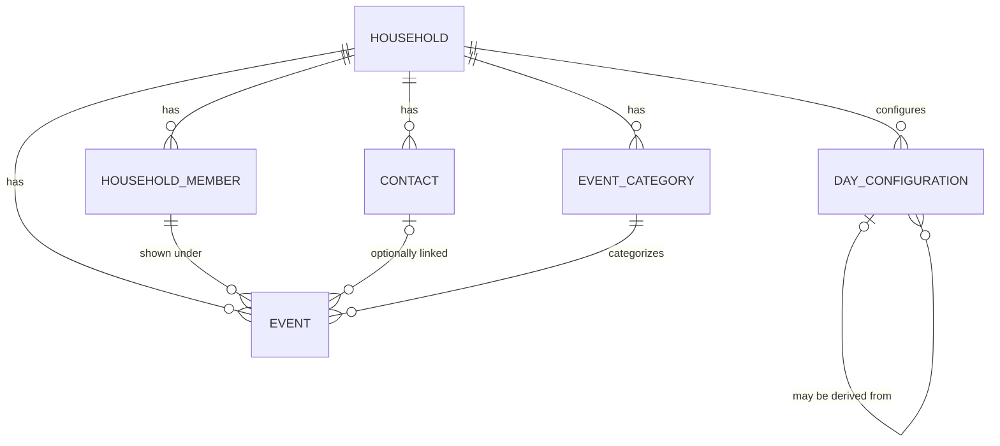

# Data Model Plan

## Recorded decisions

- Database: Supabase PostgreSQL
- API data access: provider abstraction in `/api/shared/db` (current provider: Supabase)
- Tenancy: multi-tenant; every household-owned table is scoped by `householdId`
- Household-owned models: `HouseholdMember`, `Contact`, `EventCategory`, `Event`, `DayConfiguration`
- Recurrence format: RFC 5545 `RRULE` strings
- Calendar annotations (public holidays, bridge days, school holidays, custom days): unified `DayConfiguration` model
- Terminology: use `HouseholdMember` (not `FamilyMember`)

## Mermaid ERD

## Notes

- For concrete SQL table definitions currently used by the app (`households`, `household_members`, `contacts`, `tasks`), see `/home/runner/work/family-butler-v2/family-butler-v2/docs/SUPABASE.md`.
- Additional entities in this model (`EventCategory`, `Event`, `DayConfiguration`) remain planned for future API implementation.
- Service-layer validation must enforce same-household consistency for cross-table references.
