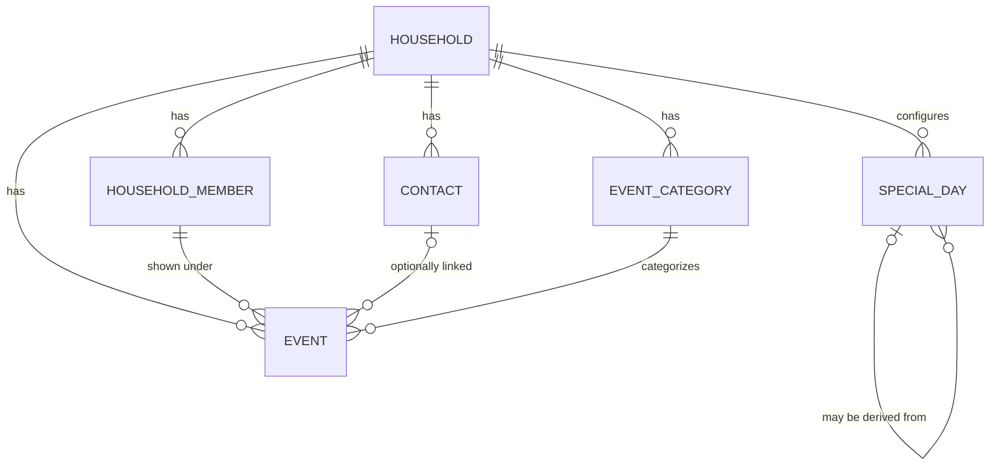

# Data Model Plan (Issue #11)

## Recorded decisions

- Database: PostgreSQL
- ORM: Prisma ORM
- Tenancy: multi-tenant; every household-owned table is scoped by `householdId`
- Household-owned models: `HouseholdMember`, `Contact`, `EventCategory`, `Event`, `SpecialDay`
- Recurrence format: RFC 5545 `RRULE` strings
- Calendar annotations (public holidays, bridge days, school holidays, custom days): unified `SpecialDay` model
- Terminology: use `HouseholdMember` (not `FamilyMember`)

## Mermaid ERD

## Entities, fields, and constraints

### `Household`

- `id` UUID PK (`String @id @default(uuid()) @db.Uuid`)
- `name` required
- `holidayRegion` required
- `createdAt`, `updatedAt` as `@db.Timestamptz(6)`
- Owns `HouseholdMember[]`, `Contact[]`, `EventCategory[]`, `Event[]`, `SpecialDay[]`
- Delete behavior: deleting a household cascades to all owned records

### `HouseholdMember`

- Required: `id`, `householdId`, `firstName`, `avatarColor`, `visibleInCalendar`, `sortOrder`, audit timestamps
- Optional: `role`, `avatarPhotoUrl`
- Prisma field `sortOrder` is mapped to SQL column `order` with `@map("order")`
- Constraints:
  - `@@unique([householdId, sortOrder])`
  - `@@index([householdId, sortOrder])`
- Relations:
  - belongs to `Household` (`onDelete: Cascade`)
  - has many `Event`
  - event relation enforces `onDelete: Restrict` from member to events

### `Contact`

- Required: `id`, `householdId`, `firstName`, audit timestamps
- Optional: `lastName`, `mobilePhone`, `email`, `birthDay`, `birthMonth`, `birthYear`
- Date part types: `birthDay`, `birthMonth`, `birthYear` as `@db.SmallInt`
- Constraints:
  - `@@index([householdId, firstName, lastName])`
- Relations:
  - belongs to `Household` (`onDelete: Cascade`)
  - may be referenced by many `Event`
  - on contact delete, event `contactId` is cleared (`onDelete: SetNull`)
- Required service-layer validation:
  - `birthDay` and `birthMonth` must both be null or both be set
  - day/month ranges must be valid
  - month/day combinations should be valid

### `EventCategory`

- Required: `id`, `householdId`, `name`, audit timestamps
- Optional: `color`
- Constraints:
  - `@@unique([householdId, name])`
- Relations:
  - belongs to `Household` (`onDelete: Cascade`)
  - has many `Event`
  - deletion is blocked when events reference the category (`onDelete: Restrict`)

### `Event`

- Required: `id`, `householdId`, `householdMemberId`, `categoryId`, `title`, `startAt`, `allDay`, `isRecurring`, audit timestamps
- Optional: `contactId`, `endAt`, `rrule`, `notes`
- Temporal types:
  - `startAt`, `endAt`, `createdAt`, `updatedAt` use `@db.Timestamptz(6)`
- Constraints/indexes:
  - `@@index([householdId, startAt])`
  - `@@index([householdMemberId, startAt])`
  - `@@index([contactId])`
  - `@@index([categoryId])`
- Relations:
  - belongs to `Household` (`onDelete: Cascade`)
  - required `HouseholdMember` (`onDelete: Restrict`)
  - required `EventCategory` (`onDelete: Restrict`)
  - optional `Contact` (`onDelete: SetNull`)
- Recurrence behavior:
  - recurrence stored as RFC 5545 `rrule`
  - no pre-generated occurrence rows
  - range expansion happens at query time in future service logic

### `SpecialDay`

- Enums:
  - `SpecialDayType`: `PUBLIC_HOLIDAY`, `BRIDGE_DAY`, `SCHOOL_HOLIDAY`, `CUSTOM`
  - `SpecialDaySource`: `AUTO`, `CUSTOM`
- Required: `id`, `householdId`, `name`, `type`, `startDate`, `source`, audit timestamps
- Optional: `endDate`, `displayColor`, `relatedSpecialDayId`
- Date types:
  - `startDate`, `endDate` use `@db.Date` (local calendar dates, not instants)
- Relations:
  - belongs to `Household` (`onDelete: Cascade`)
  - optional self-reference via `relatedSpecialDayId` (`onDelete: SetNull`)
  - named self-relation `SpecialDayDerivation`
- Indexes:
  - `@@index([householdId, startDate])`
  - `@@index([householdId, endDate])`
  - `@@index([relatedSpecialDayId])`
- Calendar range query requirement for a displayed local date:
  - `startDate <= calendarDate AND (endDate IS NULL OR endDate >= calendarDate)`

## Required cross-record/service validation (deferred to API/service layer)

Prisma FK constraints do not enforce same-household consistency across all referenced records. Future service logic must validate:

1. Event references (`householdMemberId`, `categoryId`, optional `contactId`) all belong to the same `householdId` as the event.
2. `Event.endAt >= Event.startAt` when `endAt` is present.
3. `Event.rrule` is non-null and valid when `isRecurring = true`.
4. `Event.rrule` is null when `isRecurring = false`.
5. `SpecialDay.endDate >= SpecialDay.startDate` when `endDate` is present.
6. `SpecialDay.relatedSpecialDayId`, when present, points to a record in the same household.

## Bridge-day and holiday-source behavior

- Bridge day is stored as `SpecialDay(type = BRIDGE_DAY, source = CUSTOM)`.
- Bridge day may optionally reference the causing public holiday through `relatedSpecialDayId`.
- Future auto-imported regional holidays use `type = PUBLIC_HOLIDAY` and `source = AUTO`.
- If imported entries are manually edited later, they should be marked `source = CUSTOM`.

## Out of scope for this issue

- User/auth/access-control models
- API routes, CRUD services, server actions, and UI wiring
- Prisma migration generation/application
- Seed data
- Public holiday import/synchronization jobs
- Single-occurrence recurrence exceptions
- Extended contact/CRM fields

## Follow-up decisions

- Add DB-level `CHECK` constraints (via migrations) for date/rule invariants where strict database enforcement is desired.
- Introduce `User` and household membership/access model before production deployment.
- Implement service-layer validation and recurrence expansion behavior.
