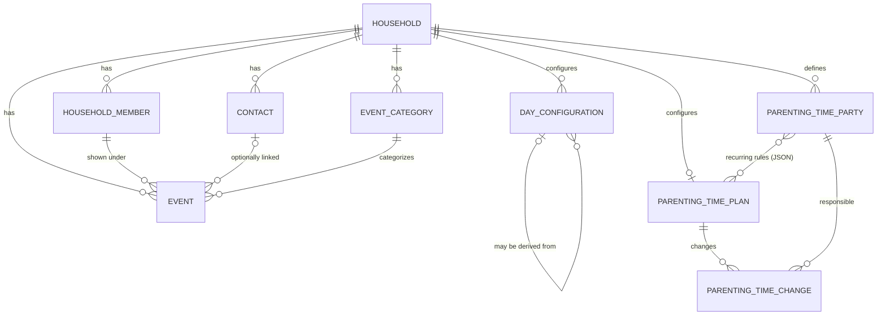

# Data Model Plan

## Recorded decisions

- Database: Supabase PostgreSQL
- API data access: provider abstraction in `/api/shared/db` (current provider: Supabase)
- Tenancy: multi-tenant; every household-owned table is scoped by `householdId`
- Household-owned models: `HouseholdMember`, `Contact`, `EventCategory`, `Event`, `DayConfiguration`, `ChildcareProvider`, `ChildcareArrangement`, `ChildcareOverride`, `ParentingTimeParty`, `ParentingTimePlan`, `ParentingTimeChange`
- Event recurrence format: RFC 5545 `RRULE` strings; childcare uses explicit weekly weekdays (see below).
- Calendar annotations (public holidays, bridge days, school holidays, custom days): unified `DayConfiguration` model
- Terminology: use `HouseholdMember` (not `FamilyMember`)

## Mermaid ERD


```mermaid
erDiagram
    HOUSEHOLD ||--o{ HOUSEHOLD_MEMBER : has
    HOUSEHOLD ||--o{ CONTACT : has
    HOUSEHOLD ||--o{ EVENT_CATEGORY : has
    HOUSEHOLD ||--o{ EVENT : has
    HOUSEHOLD ||--o{ DAY_CONFIGURATION : configures
    HOUSEHOLD ||--o{ PARENTING_TIME_PARTY : defines
    HOUSEHOLD ||--o| PARENTING_TIME_PLAN : configures
    PARENTING_TIME_PLAN ||--o{ PARENTING_TIME_CHANGE : changes
    PARENTING_TIME_PARTY ||--o{ PARENTING_TIME_CHANGE : responsible
    HOUSEHOLD_MEMBER ||--o{ EVENT : "shown under"
    CONTACT o|--o{ EVENT : "optionally linked"
    EVENT_CATEGORY ||--o{ EVENT : categorizes
    DAY_CONFIGURATION o|--o{ DAY_CONFIGURATION : "may be derived from"
    PARENTING_TIME_PARTY }o--o{ PARENTING_TIME_PLAN : "recurring rules (JSON)"
```

## Notes

- For concrete SQL table definitions currently used by the app (`households`, `household_members`, `contacts`, `tasks`), see `/home/runner/work/family-butler-v2/family-butler-v2/docs/SUPABASE.md`.
- Event type and event entities are now persisted via `event_types` and `events` tables (household-scoped with `ON DELETE CASCADE` on household deletion).
- Day configurations are persisted in the `day_configurations` table and are available through the household API and agent tools.
- Service-layer validation must enforce same-household consistency for cross-table references.

## Parenting time — persisted plan and server resolver

Parenting time models who is responsible for all children in a household. It is separate from childcare, ordinary `Event` records, and `DayConfiguration`. A `ParentingTimeParty` can optionally link to a `HouseholdMember` in the same household; it does not require one, so a co-parent need not be represented as a household member.

Apply `docs/sql/parenting-time.sql` after the core Supabase schema.

### Persisted model

- `parenting_time_parties`: household-owned named parties (for example, Mum and Dad), with an optional `memberId` link to a same-household `HouseholdMember` and an `active` flag. Parties can be renamed, linked, archived, and restored; archive preserves references from existing plans and changes. Standalone parties remain supported.
- `parenting_time_plans`: at most one household-wide plan, local effective-from date, optional inclusive effective-through date, IANA time zone, recurrence mode (`weekly` or `alternating`), activation state, compiled recurring rules, and the editable handover list. A handover has a stable UUID, ISO weekday (Monday = 1 through Sunday = 7), local time, `fromPartyId`, `toPartyId`, and optional `weekParity` (`odd` or `even`). Add one or more handovers; the resolver requires their recurring sequence to be consistent and to define responsibility across the entire week/two-week cycle. Handovers compile server-side into recurring rules, so gaps and overlaps between different parties are rejected. The legacy period-rule format remains supported for existing plans.
- `parenting_time_changes`: dated, half-open `[startAt, endAt)` timestamp interval, responsible party, and explanatory label. Changes must not overlap one another and take precedence over the recurring plan only within their interval.

Recurring rule times are household-local wall-clock times in the plan's IANA time zone. When a wall time occurs twice at a daylight-saving transition the resolver uses the earlier occurrence; a nonexistent wall time is reported as invalid for that requested range. One-off change timestamps and resolver range bounds are timezone-bearing ISO 8601 date-times and are normalized to UTC.

Resolution starts at the plan's `effectiveFrom` local midnight; requests wholly before that date return no intervals. Existing dated changes prevent moving a plan's effective date past their start.

Alternating rules and handovers match the ISO calendar-week number of their start date: odd means weeks 1, 3, 5, etc.; even means weeks 2, 4, 6, etc. This intentionally follows ISO week numbering across year boundaries. The handover weekday determines parity, so an alternating weekend beginning Friday is selected by the Friday's week number. An omitted parity applies every week. Weekly plans cannot specify parity.

On save/activation, the API rejects invalid party references, weekday/time ranges, duplicate rule IDs, uncovered times, and recurring rules assigning different parties to overlapping times. The resolver also reports any persisted gaps or ambiguity rather than returning a partial schedule. Adjacent intervals with the same responsible party are coalesced, so a seamless same-party handover boundary is not shown as a change of responsibility. Each returned plan interval retains source parts identifying the recurring rule IDs; a one-off interval identifies its change ID and label.

### API

All paths are relative to `/api/households/{householdId}/parenting-time`. Requests use the household API's Supabase bearer token or `x-supabase-auth-token` header. Every read and write verifies household ownership and is scoped by `householdId`.

| Method | Suffix | Behavior |
| --- | --- | --- |
| GET | (none) | Reload persisted `{ parties, plan, changes }`. |
| POST | `/parties` | Create `{ "name": "Father", "memberId": "<optional same-household member UUID>" }` (repeat for Mother). |
| PUT | `/parties` | Edit `{ id, name, memberId, active }`; set `active: false` to archive or `true` to restore. |
| POST or PUT | `/plan` | Persist/replace and validate the household plan. `effectiveTo` is an optional inclusive end date; use `active: false` to save an inactive plan. |
| POST or PUT | `/changes` | Create a one-off interval or update one using its `id`. |
| DELETE | `/changes?id=<change UUID>` | Remove a one-off change. |
| POST | `/preview` | Resolve a draft plan without saving: `{ plan, startAt, endAt }` → `{ intervals }`, using the same server resolver and persisted changes. |
| GET | `/resolve?startAt=2026-10-08T00:00:00Z&endAt=2026-10-13T00:00:00Z` | Return `{ intervals }` for a range of at most 366 days. |

Create the representative plan (using returned party UUIDs) with its handover events:

```json
{
  "effectiveFrom": "2026-01-01",
  "timeZone": "Europe/Zurich",
  "recurrenceMode": "alternating",
  "active": true,
  "handovers": [
    { "weekday": 1, "time": "19:30", "fromPartyId": "<father UUID>", "toPartyId": "<mother UUID>" },
    { "weekday": 4, "time": "19:30", "fromPartyId": "<mother UUID>", "toPartyId": "<father UUID>" },
    { "weekday": 5, "time": "17:00", "fromPartyId": "<father UUID>", "toPartyId": "<mother UUID>", "weekParity": "even" },
    { "weekday": 7, "time": "19:30", "fromPartyId": "<mother UUID>", "toPartyId": "<father UUID>", "weekParity": "even" }
  ]
}
```

On an odd ISO Friday-week, Father's Thursday period continues through Sunday and ends Monday at 19:30 without an intervening handover. On an even week, Father hands over Friday at 17:00 to Mother, and Father resumes Sunday at 19:30. A dated change can replace responsibility during any selected interval, for example:

```json
{ "partyId": "<mother>", "startAt": "2026-10-09T18:00:00Z", "endAt": "2026-10-09T20:00:00Z", "label": "Agreed swap" }
```

Settings → Parenting Time provides household-wide party, recurring-handover, and dated-change management. Add or remove handovers as needed; each has a weekday/time, from/to parties, and a weekly, odd ISO-week, or even ISO-week recurrence. The handover list supports schedules such as weekday handovers combined with alternating weekends. It previews the next 14 days through `/preview`; persisted schedule views use `/resolve`. The resolver does not pre-generate future occurrences or create generic events. Ordinary household saves do not replace parenting-time data. Calendar presentation and agent tools are not included.

## Childcare — implemented

Childcare is separate from `Event` records. Apply `docs/sql/childcare.sql` after the core Supabase schema.

### Persisted model

- `childcare_providers`: household-owned named provider with type `grandparent`, `individual_carer`, `daycare`, `school_programme`, or `other`, and an `active` boolean (default true). Providers are independent of contacts. Deactivation hides a provider from new selections, not from existing arrangements or resolved care; reactivate it to select it again.
- `childcare_arrangements`: provider, nonempty `childIds` (household member UUIDs), nonempty `weekdays` (ISO Monday = 1 through Sunday = 7), inclusive `startDate`, optional inclusive `endDate`, and `allDay`/`startTime`/`endTime`. One arrangement can cover multiple weekdays and multiple children, all sharing its provider and times. Different times require separate arrangements. There is no new child-role classification; callers choose participating household members.
- `childcare_overrides`: one row per `(householdId, arrangementId, originalDate)`, with action `add`, `cancel`, `replace`, or `move`. For cancel/replace/move, `originalDate` must be a date in the arrangement's weekly schedule. An `add` uses `originalDate` as an extra care date outside the weekly schedule, and inherits the chosen arrangement's provider, children, and timing (optional provider/timing fields can customize it). `move` requires a different `movedDate`; replacement provider and timing are optional for moves. `replace` requires provider and/or timing changes. Repeated writes replace that occurrence's entire override, not the weekly arrangement.
- All-day care has null times. Timed care requires increasing same-day `HH:MM` times. Overnight care is not supported. Dates and times are household-local wall-clock values, not UTC instants; the resolver uses UTC date arithmetic only to avoid timezone/DST drift.
- This first iteration deliberately supports simple weekly recurrence rather than RRULE parsing, alternating weeks, or holiday exclusions. Special days do not automatically cancel care.

Composite foreign keys enforce same-household providers and arrangements. SQL triggers validate household children and override source dates. Child validation and member deletion/transfer share a household-level transaction lock to prevent concurrent writes from leaving dangling references. Deleting or transferring a referenced member is rejected until its childcare arrangements are removed; household deletion still cascades. Childcare RLS allows authenticated household owners only, matching `households.created_by_user_id`. Azure Functions additionally authenticate and check ownership before accessing the server-side provider.

### API

All paths below are relative to `/api/households/{householdId}/childcare`; use the same Supabase bearer token or `x-supabase-auth-token` header as the household API. IDs in responses are server-generated UUIDs. Request-body IDs and `householdId` cannot override route scoping.

| Method | Suffix | Behavior |
| --- | --- | --- |
| GET | (none) | Reload persisted `{ providers, arrangements, overrides }`. |
| POST | `/providers` | Create `{ "name": "Grandparents", "type": "grandparent" }`. |
| PUT | `/providers` | Edit `{ id, name, type, active }`; deactivate/reactivate with `active: false/true`. |
| POST | `/arrangements` | Create a validated weekly arrangement (example below). |
| PUT | `/arrangements` | Edit a weekly arrangement using `id` and all arrangement fields. |
| POST | `/preview` | Resolve a draft without writing: `{ arrangement, startDate, endDate }` → `{ occurrences }`. Include the existing arrangement `id` when editing to apply its saved overrides. Range limit is 366 days, as for `/occurrences`. |
| PUT | `/overrides` | Set or replace one scheduled occurrence's change, or add a date to an arrangement outside its weekly schedule. |
| GET | `/occurrences?startDate=2026-10-01&endDate=2026-10-31` | Return `{ occurrences }` for an inclusive range of at most 366 days. |

Create an arrangement using the returned provider UUID and existing member UUIDs:

```json
{
  "providerId": "<provider UUID>",
  "childIds": ["<child member UUID>", "<another child member UUID>"],
  "weekdays": [1, 3],
  "startDate": "2026-10-01",
  "endDate": null,
  "allDay": false,
  "startTime": "11:45",
  "endTime": "13:30"
}
```

For all-day care, use `"allDay": true` and omit both times. Example occurrence overrides:

```json
{ "arrangementId": "<arrangement UUID>", "originalDate": "2026-10-06", "action": "add" }
```

The added day inherits the arrangement's provider, children, and timing. It can optionally specify `providerId` and timing fields to customize that date. To remove it, replace the same unscheduled date's override with `"action": "cancel"`.

```json
{ "arrangementId": "<arrangement UUID>", "originalDate": "2026-10-05", "action": "cancel" }
```

```json
{
  "arrangementId": "<arrangement UUID>",
  "originalDate": "2026-10-05",
  "action": "replace",
  "providerId": "<replacement provider UUID>",
  "allDay": false,
  "startTime": "12:00",
  "endTime": "14:00"
}
```

```json
{
  "arrangementId": "<arrangement UUID>",
  "originalDate": "2026-10-05",
  "action": "move",
  "movedDate": "2026-11-03"
}
```

Provider-only changes inherit normal timing. A partial timed change inherits omitted times from the arrangement; switching from all-day to timed care requires both times. Switching to all-day clears times. Cancelling cannot include provider/time replacements.

### Resolution and boundaries

The occurrences endpoint reads persisted arrangements and overrides, never generic events. The preview endpoint validates a supplied draft against household providers and members, then uses the same resolver with that draft and any existing overrides; it does not save anything. An added day resolves at its own date without changing the arrangement's weekly schedule or effective date bounds. Cancellation removes only its occurrence. Replacement preserves the original date. A move suppresses the original date and appears at its destination even when the source date is outside the requested range or the destination is beyond the arrangement's normal bounds. The stable occurrence ID is `<arrangementId>:<originalDate>` (new unsaved previews use `preview` as the arrangement ID). Results contain `householdId`, `arrangementId`, `originalDate`, effective `date`, `providerId`, `childIds`, timing, and nullable `overrideAction`, sorted by effective date, start time, and ID. The authenticated occurrences API also provides the resolved provider name for calendar display.

Overlapping arrangements and moves onto another scheduled day remain separate occurrences; no capacity/conflict inference is performed. Arrangement edits retain saved overrides. Changing weekdays or effective dates to exclude an override's original date is rejected both by the API (including previews) and the database, rather than silently discarding the change.

Settings → Childcare exposes provider management, weekly arrangement editing with multiple children, draft previews, upcoming single-occurrence changes, and the ability to add a date to a selected arrangement. Historical resolved care is read-only in Settings. Provider schedules offer chronological lists and monthly calendars for custom inclusive ranges up to 366 days and selection of active or inactive providers. Filtering uses the effective `providerId` from persisted resolved occurrences, not the base arrangement provider; moved and replacement care therefore appears under the effective provider/date, including moves from outside the range. Both views preserve shared children, timing, and one-off labels. The household calendar displays resolved all-day and timed childcare for its visible range, including provider, children, and one-off changes. The read-only `get_childcare_coverage` agent tool returns explainable resolved coverage for a requested range. The current model has no descriptive arrangement name or notes. Cancelled occurrences are listed separately because they are excluded from resolved care. Deleting arrangements and clearing overrides are not exposed. Ordinary household saves do not replace childcare data.

Arrangement saving requires a successful preview. Changing the draft or preview dates invalidates that preview; review the refreshed results before saving. Previews are advisory rather than reservations or conflict checks.

Run focused regression tests from the repository root with `npm run test:api`; run `npm run build` for workspace build verification. Tests cover weekly resolution, multiple children, added days, cancellations/replacements/moves, range boundaries, invalid input, household authorization, provider paging, provider activation/editing, arrangement editing, non-persisting previews, API persistence/reload, and existing health/household reads using a mocked Supabase transport.
