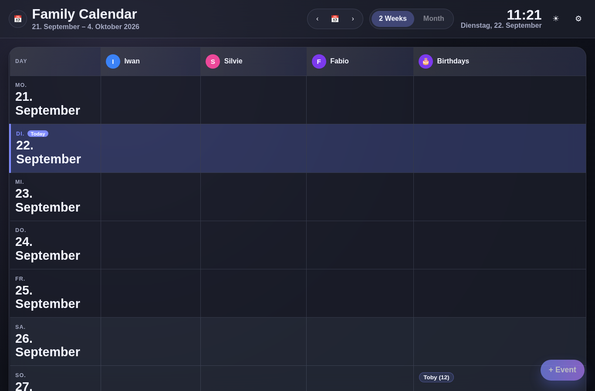
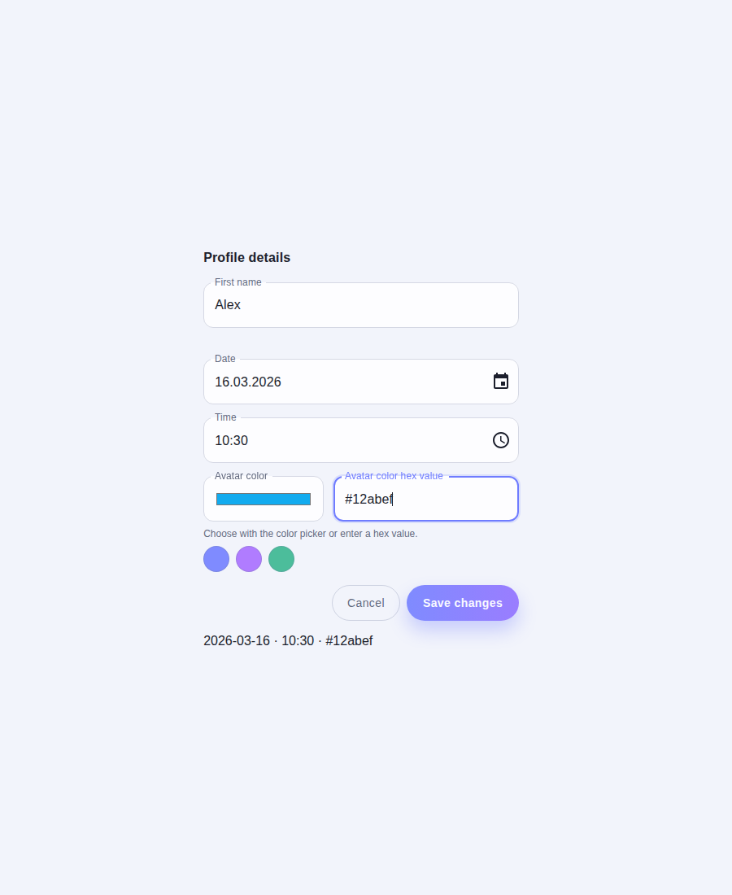
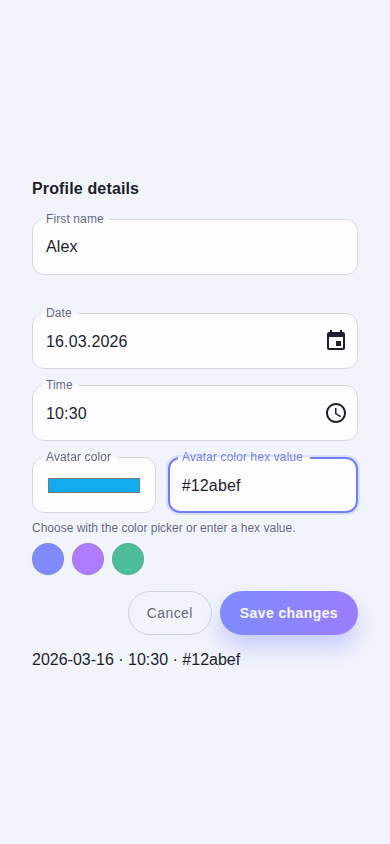
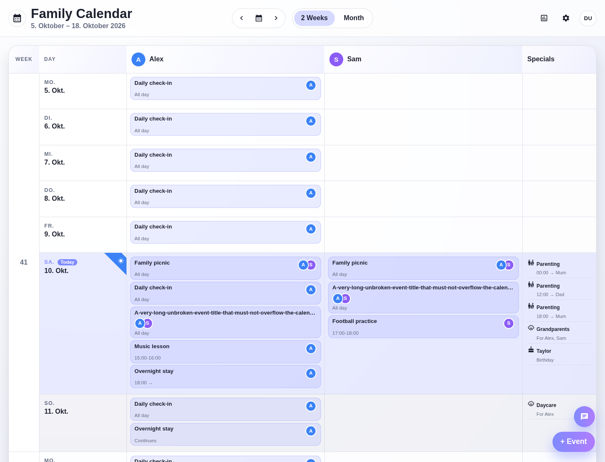

# Family Butler Dashboard Styleguide

## Current implementation screenshot

## Chosen UI stack

- **Framework:** React + TypeScript + Vite (existing repository stack)
- **Styling approach:** Component-scoped CSS with CSS custom properties for theme tokens
- **Why:** Keeps changes minimal and aligned with the existing codebase while still supporting the required glassmorphism and light/dark theming without introducing additional framework dependencies.

## Color tokens

### Light mode

- `--bg`: `#f2f4fb`
- `--surface`: `rgba(255, 255, 255, 0.74)`
- `--surface-strong`: `rgba(255, 255, 255, 0.84)`
- `--text-primary`: `#1c1f2d`
- `--text-secondary`: `#666d83`
- `--accent` (today + active toggle): `#7f8bff`
- `--today-bg`: `rgba(127, 139, 255, 0.16)`
- `--weekend-bg`: `rgba(110, 120, 154, 0.08)`

### Dark mode

- `--bg`: `#090b14`
- `--surface`: `rgba(32, 35, 48, 0.62)`
- `--surface-strong`: `rgba(39, 42, 57, 0.72)`
- `--text-primary`: `#f3f5ff`
- `--text-secondary`: `#a4a9c2`
- `--accent` (today + active toggle): `#7f8bff`
- `--today-bg`: `rgba(110, 128, 255, 0.22)`
- `--weekend-bg`: `rgba(62, 74, 92, 0.22)`

### Member avatar accents

- Blue: `#3b82f6`
- Orange: `#f97316`
- Pink: `#ec4899`
- Purple: `#7c3aed`
- Birthday icon avatar uses purple to match the accent family.

## Typography scale

- Font stack: `Inter, "Segoe UI", Roboto, Helvetica, Arial, sans-serif`
- Header title: `~1.95rem`, bold
- Header subtitle/meta text: `~0.95rem`, semibold muted
- Live clock main value: `~2rem`, bold
- Calendar day label system:
  - Weekday: uppercase, muted, compact (`~0.79rem`, high letter spacing)
  - Date: bold, larger (`~1.8rem` desktop)

## Spacing and radius scale

- Card/header padding baseline: `1rem`–`1.25rem`
- Pill/button radius: `999px` (fully rounded)
- Card radius: `~1.45rem`
- Cell padding: `~0.75rem`–`0.9rem`

## Shared form controls

- Use `SecondaryButton` for non-primary dialog actions and `GradientButton` for the primary action.
- Use the shared date picker for date-only values. It displays Swiss German `DD.MM.YYYY`; form and API state remains the local calendar date in ISO `YYYY-MM-DD` format.
- Use the shared time picker for time entry. It uses a 24-hour clock, 5-minute picker steps, and preserves `HH:mm` values.
- Use the shared color picker for member and event-type colors. Member editing presents one accessible color input without preset swatches; the event-type picker also retains editable hex entry.
- Put secondary settings guidance behind an accessible info button beside its section title, so it remains available on hover, keyboard focus, and touch without taking up persistent page space.
- Calendar Specials use a consistent icon, title, and subtitle. Birthday subtitles identify the occasion, childcare subtitles identify participants, and parenting subtitles show the handover or responsible party.

### Shared control and calendar references

Desktop and mobile shared form controls:

Calendar Specials entry layout:

## Glassmorphism recipe

Used for the sticky header and calendar card:

- `backdrop-filter: blur(20px)`
- `background`: semi-transparent surface token (`--surface`)
- `border`: `1px solid var(--border)`
- `box-shadow`: soft elevated shadow (`--shadow`)

## Do / Don’t

### Do

- Use tokenized colors (`--*`) rather than hardcoding new neutrals.
- Keep controls rounded and high-contrast against translucent surfaces.
- Preserve locale-aware date rendering for calendar text.
- Keep date parsing and serialization timezone-free; do not convert date-only values through UTC timestamps.

### Don’t

- Don’t couple birthdays to `FamilyMember`; keep special events separate.
- Don’t add heavy UI frameworks unless the project direction changes.
- Don’t replace data-driven visibility logic with hardcoded member columns.
